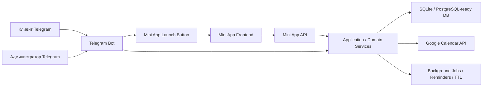
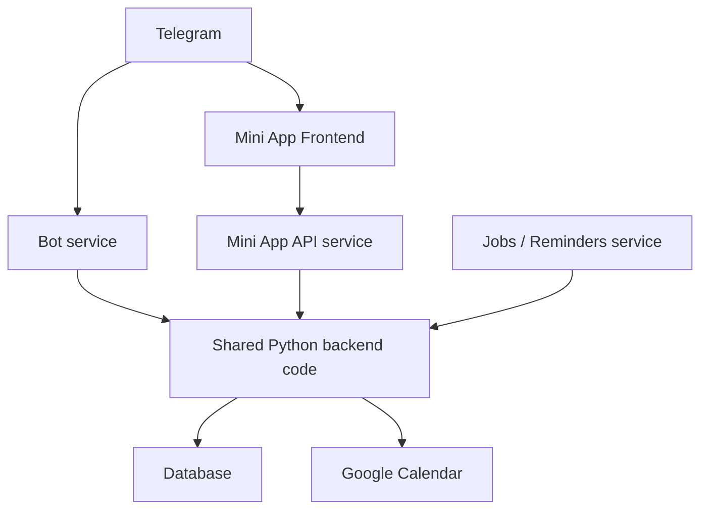

# Архитектура проекта для mini-app

## Назначение документа

Этот документ описывает целевую архитектуру только для `Telegram Mini App` проекта `Запись на встречу`.

Важно:
- этот документ относится только к `mini-app`;
- он не заменяет и не переписывает существующую архитектуру бота;
- он должен использоваться вместе с [Техническое задание для mini-app.md](</Users/elenarazumova/Desktop/Vibe-project/Согласование встреч Google календарь/Техническое задание для mini-app.md>), [Стек технологий для mini-app.md](</Users/elenarazumova/Desktop/Vibe-project/Согласование встреч Google календарь/Стек технологий для mini-app.md>) и [Контент и тексты для mini-app.md](</Users/elenarazumova/Desktop/Vibe-project/Согласование встреч Google календарь/Контент и тексты для mini-app.md>).

## 1. Архитектурная цель

Целевая архитектура должна обеспечить:
- запуск `Mini App` как нового основного интерфейса для клиента и администратора;
- сохранение текущего Telegram-бота как точки входа, канала уведомлений и fallback-режима;
- переиспользование существующей бизнес-логики без переписывания проекта с нуля;
- безопасную авторизацию через Telegram Web App;
- удобную локальную разработку;
- отдельный и понятный контур файлов именно для `mini-app`;
- возможность поэтапной реализации без хаоса.

## 2. Главный принцип

`Mini App` не должен становиться отдельным новым продуктом с дублированием логики.

Нужно сохранить следующую модель:
- текущий backend бота остается ядром;
- `Mini App` добавляет новый frontend-слой;
- для `Mini App` добавляется web/API слой внутри того же backend;
- bot-flow и web-flow работают поверх одного ядра бизнес-правил.

Иными словами:
- не переписываем то, что уже работает;
- расширяем архитектуру аккуратно;
- не дублируем логику слотов, статусов, подтверждений и календаря.

## 3. Архитектурный стиль

Рекомендуемый стиль: `модульный монолит с двумя интерфейсами`.

Это означает:
- один репозиторий;
- одна основная кодовая база backend;
- одна база данных;
- один набор бизнес-правил;
- два интерфейса взаимодействия:
  - Telegram Bot;
  - Telegram Mini App.

Это лучший вариант для проекта, потому что:
- текущий бот уже реализован;
- важна обратная совместимость;
- проект не требует микросервисной сложности;
- `Mini App` должен расширять, а не ломать существующую систему.

## 4. Контекст системы



## 5. Логическая модель

### 5.1. Слои системы

#### 1. Frontend layer

Это web-интерфейс Mini App.

Содержит:
- клиентские экраны;
- админские экраны;
- навигацию;
- работу с Telegram Web App API;
- отправку запросов в backend API;
- локальное UI-состояние.

Во frontend не должно быть:
- принятия бизнес-решений по слотам;
- доверенных проверок ролей;
- прямой логики по Google Calendar;
- логики статусов, существующей только в браузере.

#### 2. Web/API presentation layer

Это новый HTTP-слой для Mini App.

Содержит:
- маршруты API;
- схемы запросов и ответов;
- проверку `initData`;
- авторизацию по Telegram-пользователю;
- маппинг HTTP-запросов на application-сценарии.

Этот слой:
- не должен дублировать бизнес-правила;
- должен вызывать уже существующие сервисы и use case.

#### 3. Bot presentation layer

Это текущий слой Telegram-бота.

Он остается в системе и отвечает за:
- `/start`;
- уведомления;
- fallback-сценарии;
- резервный канал для критически важных пользовательских и админских действий.

#### 4. Application layer

Это главный переиспользуемый слой.

Содержит:
- сценарии создания, отмены, переноса и подтверждения заявок;
- расчет доступных слотов;
- работу с листом ожидания и срочными заявками;
- управление доступностью;
- управление напоминаниями;
- формирование данных для календаря и статусов.

#### 5. Domain layer

Содержит:
- сущности;
- статусы;
- доменные ограничения;
- инварианты;
- правила переходов между состояниями.

#### 6. Infrastructure layer

Содержит:
- БД;
- миграции;
- репозитории;
- интеграцию с Google Calendar;
- логирование;
- фоновые задачи;
- конфигурацию;
- runtime для API, бота и jobs.

## 6. Предлагаемая структура репозитория

Ниже структура, которая должна четко отделить `mini-app` от уже существующего bot-only кода.

```text
project-root/
├── frontend/
│   └── miniapp/
│       ├── src/
│       ├── public/
│       ├── tests/
│       ├── package.json
│       └── vite.config.*
├── src/
│   └── app/
│       ├── bot/
│       ├── web/
│       │   ├── api/
│       │   │   ├── routers/
│       │   │   ├── schemas/
│       │   │   ├── dependencies/
│       │   │   └── security/
│       │   ├── services/
│       │   └── runtime.py
│       ├── application/
│       ├── domain/
│       ├── modules/
│       └── infrastructure/
├── tests/
│   ├── unit/
│   ├── integration/
│   └── miniapp/
│       ├── api/
│       ├── frontend/
│       └── e2e/
├── docker/
├── deploy/
├── docs/
└── *.md
```

### 6.1. Зоны ответственности по файлам

Чтобы кодящая нейросеть не перепутала `mini-app` и бот, нужно считать безопасными следующие зоны:

#### Новые mini-app зоны

- `frontend/miniapp/**`
- `src/app/web/**`
- `tests/miniapp/**`
- `docs/**`, если документ явно относится к `mini-app`
- новые mini-app markdown-файлы в корне с названием `... для mini-app`

#### Разрешенные точки расширения общего backend

- `src/app/application/**`
- `src/app/modules/**`
- `src/app/domain/**`
- `src/app/infrastructure/**`

Только если это действительно нужно для общего ядра.

#### Ограниченные точки касания с ботом

Редактировать только по необходимости:
- `src/app/bot/handlers/start.py`
- `src/app/bot/keyboards/**`
- `src/app/bot/runtime.py`
- другие bot-файлы только если это нужно для fallback или кнопки открытия Mini App.

#### Чего нельзя делать без явной причины

- переименовывать существующие bot-only документы;
- переносить bot-логику в frontend;
- делать отдельную вторую реализацию слотов и статусов специально для Mini App;
- массово реорганизовывать весь backend ради web-слоя.

## 7. Предлагаемая runtime-топология

Для production рекомендуется следующая схема:



### 7.1. Сервисы

#### 1. `bot-service`

Отвечает за:
- Telegram webhook/polling;
- стартовое сообщение;
- уведомления;
- fallback-сценарии.

#### 2. `api-service`

Отвечает за:
- Mini App API;
- проверку `initData`;
- выдачу данных для клиента и администратора;
- выполнение действий из Mini App.

#### 3. `jobs-service`

Отвечает за:
- TTL;
- напоминания за час;
- фоновую очистку;
- любые запланированные фоновые операции.

#### 4. `miniapp-frontend`

Отвечает за:
- сборку и отдачу SPA;
- клиентский интерфейс;
- взаимодействие с Telegram Web App.

### 7.2. Почему это лучше, чем один процесс на всё

Потому что:
- бот не должен падать из-за frontend-сборки;
- API не должен зависеть от bot-runtime;
- jobs лучше запускать отдельно от пользовательского трафика;
- frontend удобно разворачивать отдельным контейнером;
- rollback становится проще.

## 8. Сетевой и доменный подход

### 8.1. Production

Рекомендуемая схема:
- отдельный поддомен под Mini App;
- frontend и API работают под одним доменным контуром;
- API желательно отдавать по пути `/api/*` на том же поддомене Mini App.

Пример:
- `https://miniapp.example.com` -> frontend
- `https://miniapp.example.com/api/*` -> backend API

Это удобно, потому что:
- проще CORS;
- проще настройка Telegram Web App;
- проще локализовать проблемы.

### 8.2. Local development

Рекомендуемая схема:
- frontend локально на `localhost`;
- API локально на отдельном порту;
- для проверки внутри Telegram использовать dev-ссылку/туннель.

## 9. API-граница Mini App

Mini App должен работать только через backend API.

### 9.1. Основные группы API

#### Auth / Session

- получить текущего пользователя;
- определить режимы доступа;
- определить текущую роль интерфейса;
- вернуть стартовые данные оболочки приложения.

#### Client

- создать новую заявку;
- получить черновик;
- сохранить черновик;
- удалить черновик;
- получить доступные слоты;
- получить мои активные заявки;
- получить историю;
- отменить заявку;
- запросить перенос;
- включить/выключить напоминание;
- перейти в лист ожидания;
- отправить срочную заявку.

#### Admin

- получить список заявок;
- фильтровать заявки;
- открыть карточку заявки;
- подтвердить заявку;
- отклонить заявку;
- обработать перенос;
- добавить комментарий;
- добавить/редактировать ссылку;
- получить календарный обзор;
- получить и обработать лист ожидания;
- управлять окнами доступности;
- управлять закрытыми днями;
- управлять внутренними блоками;
- блокировать пользователя.

### 9.2. Почему API обязателен

Потому что:
- frontend не должен иметь прямой доступ к БД;
- все критичные проверки должны жить на сервере;
- общий backend должен остаться единственным источником правды.

## 10. Подход к данным

### 10.1. Базовый принцип

Изменения схемы БД допускаются, но только:
- минимальные;
- additive;
- обратимо мигрируемые;
- без разрушения текущих bot-flow.

### 10.2. Новые типы данных, которые нужно предусмотреть

На уровне архитектуры нужно заложить место для:
- одного активного черновика новой заявки;
- листа ожидания;
- срочной заявки;
- публичного комментария администратора;
- ссылки на онлайн-встречу;
- флага напоминания за 1 час;
- источника создания заявки `bot / miniapp`;
- контекста роли интерфейса при работе `ADMIN_USER_ID`.

Финальная детализация полей и таблиц должна быть вынесена в отдельную спецификацию перед этапом реального кодинга.

## 11. Безопасность

### 11.1. Обязательные требования

- серверная проверка `initData`;
- backend-проверка роли при каждом административном действии;
- запрет доверять данным роли только из frontend;
- backend-проверка доступа к заявкам клиента;
- повторная проверка доступности слота перед критическими действиями;
- логирование отказов авторизации и отказов доступа.

### 11.2. Особое требование для `ADMIN_USER_ID`

Так как один и тот же пользователь должен иметь два режима:
- backend должен различать право на админский интерфейс и пользовательский режим просмотра;
- переключение режима в UI не должно приводить к путанице прав;
- административные действия должны разрешаться только при реальном админском контексте.

## 12. Логирование и наблюдаемость

### 12.1. Что нужно логировать обязательно

- открытие Mini App;
- успешную и неуспешную валидацию `initData`;
- переключение режима `Клиент / Админ`;
- создание заявки;
- сохранение и удаление черновика;
- переход в лист ожидания;
- отправку срочной заявки;
- подтверждение, отклонение и перенос;
- изменение доступности;
- добавление ссылки на встречу;
- отправку напоминания;
- ошибки API;
- ошибки календарной интеграции.

### 12.2. Где должны быть логи

На уровне архитектуры рекомендуется разделять:
- backend runtime logs;
- API access/error logs;
- frontend browser/dev logs;
- production container logs.

### 12.3. Принцип диагностики

Каждый этап разработки должен завершаться ответом:
- какие логи смотреть;
- где искать типичные ошибки;
- как понять, что этап действительно работает.

## 13. Тестовая стратегия

Минимальный набор уровней тестирования:

### 13.1. Backend

- unit tests для новых domain/application правил;
- integration tests для API и БД;
- сценарные тесты для критичных бизнес-потоков.

### 13.2. Frontend

- smoke-проверки навигации и ключевых экранов;
- проверка рендеринга клиентского и админского режима;
- проверка состояний загрузки, ошибок и пустых состояний.

### 13.3. E2E

- открытие Mini App;
- клиентское создание заявки;
- админское подтверждение;
- fallback в бот;
- лист ожидания;
- reminder flow;
- добавление ссылки на встречу.

## 14. Порядок внедрения без ломки текущего бота

Внедрение должно идти в таком порядке:
1. Документы и границы.
2. Каркас frontend и API.
3. Безопасная авторизация и app shell.
4. Клиентский сценарий записи.
5. Админские сценарии.
6. Расширенные функции.
7. Интеграция с ботом.
8. Деплой, CI/CD и rollback.

Это важно, потому что позволяет:
- не лезть в критичные bot-flow раньше времени;
- тестировать Mini App изолированно;
- вводить новые функции постепенно.

## 15. Что считать архитектурно правильным результатом

Архитектура считается согласованной, если:
- `Mini App` четко отделен по файлам от bot-only части;
- backend ядро остается единым;
- новый API-слой не дублирует бизнес-логику;
- роли и права не завязаны только на frontend;
- есть понятная runtime-схема для bot/api/jobs/frontend;
- заложены логи, тестируемость и rollback.
