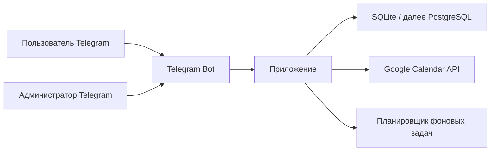
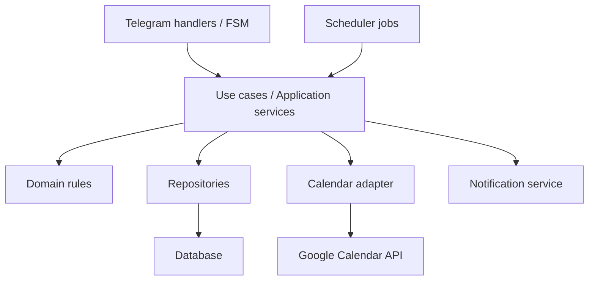
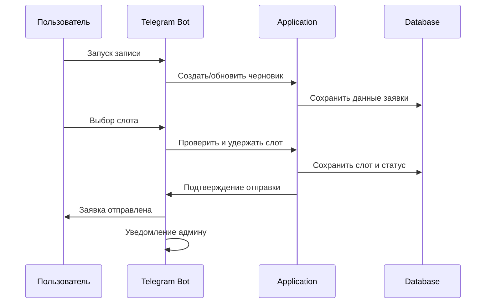
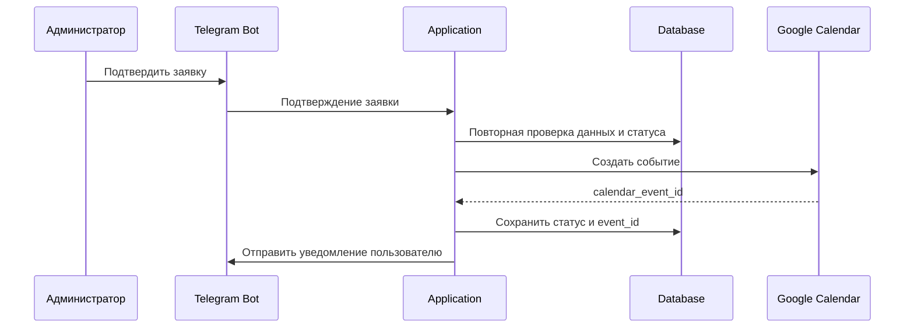

# Архитектура проекта

## Назначение документа

Этот документ описывает целевую архитектуру проекта `Запись на встречу` на основе [Техническое задание.md](</Users/elenarazumova/Desktop/Vibe-project/Согласование встреч Google календарь/Техническое задание.md>).

Документ нужен для того, чтобы:
- согласовать устройство системы до начала разработки;
- зафиксировать архитектурные решения;
- снизить риск хаотичной генерации кода нейросетями;
- обеспечить основу для перехода от Telegram-бота к `Telegram Mini App` в следующей версии.

## 1. Архитектурная цель

Целевая архитектура должна обеспечить:
- простую и надежную реализацию MVP как обычного Telegram-бота;
- хранение данных в структурированном виде, а не только в памяти;
- корректную работу со слотами, статусами и календарными событиями;
- возможность диагностировать ошибки через логи;
- минимальную сложность локального запуска;
- готовность к будущему расширению в `Mini App` без полной переработки бизнес-логики.

## 2. Границы архитектуры

### Входит в архитектуру MVP

- Telegram-бот как основной интерфейс;
- административное меню внутри Telegram;
- хранение пользователей, заявок, статусов и правил доступности;
- расчет и удержание слотов;
- подтверждение, отклонение, отмена и перенос заявок;
- интеграция с Google Calendar;
- фоновые задачи для TTL и очистки данных;
- логирование и диагностика.

### Не входит в архитектуру MVP

- отдельный веб-кабинет;
- отдельный backend API для внешних клиентов;
- CRM-интеграции;
- аналитическая платформа;
- отдельный message broker;
- отдельный кеш-сервис;
- сложная микросервисная схема.

## Актуализация архитектуры (2026-05-03)

- В presentation-слое реализован расширенный FSM для админских сценариев: кнопочные мастера для закрытия/открытия дня, weekly-окон и разовых окон на дату, а также сценарии просмотра списков закрытых дней и разовых окон.
- В модуле доступности (application/domain) фактически используется комбинированная модель: weekly-окна по дням недели + one-time windows на конкретные даты + closed dates/internal time blocks как исключения.
- В инфраструктурном календарном адаптере реализован fallback для Google Calendar: при `403 forbiddenForServiceAccounts` на операции с attendees выполняется повтор без attendees.
- Этот fallback сохраняет согласованность статусов заявки и календарного события, но меняет поведение приглашений.
- Архитектурный принцип «ядро бизнес-логики отдельно от Telegram» сохранен: расширения внесены в `Application/Service` и адаптеры, а не как логика только кнопок.

## 3. Архитектурный стиль

Для проекта рекомендуется `модульный монолит`.

Это означает:
- приложение одно;
- код разделен по слоям и модулям;
- база данных одна;
- Telegram-бот, бизнес-логика, интеграции и фоновые задачи живут в одном проекте;
- при этом код организован так, чтобы его можно было расширять без хаоса.

### Почему это лучший вариант для проекта

- проект один пользовательский, без высокой нагрузки;
- локальный запуск должен быть простым;
- не нужна сложная серверная инфраструктура;
- бизнес-логика достаточно насыщенная, и ее важно не размазать по хендлерам;
- в будущем этот монолит можно расширить `Mini App`-слоем без перехода на микросервисы.

## 4. Контекст системы



## 5. Логическая архитектура

### Общая схема



### Главный принцип

Интерфейс Telegram не должен содержать ключевые бизнес-правила. Telegram-хендлеры только:
- принимают действие пользователя;
- собирают входные данные;
- вызывают нужный сценарий application-слоя;
- показывают результат.

Все важные решения системы должны приниматься в бизнес-логике, а не в кнопках и обработчиках.

## 6. Архитектурные слои

## 6.1. Presentation layer

Это слой пользовательского взаимодействия.

Содержит:
- Telegram-команды;
- FSM-сценарии;
- inline-кнопки;
- пользовательские меню;
- админское меню;
- форматирование ответов и сообщений.

Обязанности слоя:
- принять входящее сообщение или callback;
- определить, какое действие хочет выполнить пользователь;
- передать действие в application-слой;
- показать результат в понятном виде.

Чего не должно быть в этом слое:
- расчетов доступных слотов;
- прямого изменения статусов без use case;
- сложной логики по календарю;
- SQL-запросов;
- прямых правил лимитов и TTL.

## 6.2. Application layer

Это слой сценариев системы.

Содержит:
- use case создания заявки;
- use case расчета доступных слотов;
- use case выбора слота;
- use case отправки заявки администратору;
- use case подтверждения;
- use case отклонения;
- use case отмены пользователем;
- use case переноса;
- use case закрытия дня;
- use case блокировки пользователя;
- use case автоотмены по TTL.

Обязанности слоя:
- координировать работу домена, базы и внешних интеграций;
- проверять допустимость действий;
- менять статусы;
- создавать записи истории статусов;
- инициировать уведомления;
- вызывать интеграцию с календарем.

Именно этот слой будет главным переиспользуемым ядром при переходе к `Mini App`.

## 6.3. Domain layer

Это слой предметных правил.

Содержит:
- сущности;
- перечисления статусов;
- правила расчета доступности;
- правила лимитов;
- правила удержания слотов;
- правила переходов между статусами.

Ключевые доменные правила проекта:
- максимум `7` активных будущих заявок на пользователя;
- максимум `4` встреч или удерживаемых слотов в день;
- TTL необработанной заявки `72 часа`;
- показ слотов только в `Europe/Moscow`;
- рабочие окна по умолчанию `пн-пт`, `10:00-12:00`, `14:00-16:00`;
- шаг слотов `30 минут`;
- горизонт записи `35 дней`;
- обязательный альтернативный контакт при отсутствии Telegram `username`;
- старый слот при переносе удерживается до решения администратора;
- подтвержденная встреча считается успешной только после успешного создания события в Google Calendar.

## 6.4. Infrastructure layer

Это слой технической реализации.

Содержит:
- базу данных;
- ORM-модели;
- репозитории;
- миграции;
- адаптер Google Calendar;
- конфигурацию;
- планировщик фоновых задач;
- логирование.

Обязанности слоя:
- читать и записывать данные;
- взаимодействовать с внешними API;
- обеспечивать устойчивый технический каркас для application-слоя.

## 7. Функциональные модули

Для удобства поддержки проект стоит разделить на функциональные модули.

### 7.1. Модуль пользователей

Отвечает за:
- регистрацию пользователя при первом входе;
- хранение Telegram user ID, username, display name;
- хранение имени, телефона и email;
- статус блокировки;
- последнюю активность.

### 7.2. Модуль заявок

Отвечает за:
- создание и обновление заявок;
- хранение темы, формата, длительности, комментария;
- хранение слота;
- жизненный цикл статусов;
- просмотр списка активных заявок;
- действия `отменить` и `перенести`.

### 7.3. Модуль доступности

Отвечает за:
- рабочие окна;
- закрытые даты;
- внутренние блоки времени;
- расчет слотов;
- лимит встреч в день;
- минимальное время подачи заявки;
- горизонт записи.

### 7.4. Модуль администрирования

Отвечает за:
- карточку заявки;
- подтверждение;
- отклонение;
- закрытие дня;
- изменение правил доступности;
- блокировку и разблокировку;
- поиск и фильтрацию заявок.

### 7.5. Модуль интеграции с календарем

Отвечает за:
- создание событий;
- обновление событий;
- удаление событий;
- добавление гостя по email;
- получение/учет занятости администратора при необходимости.

### 7.6. Модуль уведомлений

Отвечает за:
- уведомления администратору;
- уведомления пользователю;
- единый формат служебных сообщений;
- изоляцию текстов уведомлений от бизнес-логики.

### 7.7. Модуль фоновых задач

Отвечает за:
- автоотмену по TTL;
- очистку истории статусов старше 30 дней;
- безопасный периодический запуск сервисных операций.

## 8. Потоки данных и ключевые сценарии

## 8.1. Сценарий создания заявки



### Архитектурный смысл

- пользовательский интерфейс только собирает шаги;
- application-слой принимает решение, можно ли сохранить слот;
- база фиксирует состояние, чтобы оно не потерялось при перезапуске.

## 8.2. Сценарий подтверждения заявки



### Архитектурный смысл

- Google Calendar вызывается не из Telegram-хендлера, а из application-слоя;
- если календарь не создал событие, статус `подтверждена` не должен сохраняться;
- база и календарь должны оставаться синхронизированы.

## 8.3. Сценарий переноса

Ключевое правило:
- новый слот удерживается;
- старый слот сохраняется;
- окончательная замена старого слота происходит только после подтверждения переноса администратором.

Это значит, что архитектура заявки должна поддерживать:
- текущий активный слот;
- запрошенный новый слот;
- старый слот как источник восстановления при отказе.

## 8.4. Сценарий закрытия дня

Ключевое правило:
- закрытие дня влияет сразу и на доступность новых слотов, и на уже существующие встречи.

Архитектурно это означает:
- закрытая дата хранится в отдельной сущности;
- механизм расчета слотов учитывает ее автоматически;
- отдельный use case массово отменяет будущие встречи на эту дату;
- календарные события по этой дате удаляются через calendar adapter.

## 8.5. Сценарий блокировки пользователя

Ключевое правило:
- блокировка запрещает новые заявки;
- уже существующие будущие заявки и события отменяются.

Архитектурно это означает:
- статус блокировки хранится на пользователе;
- на входе в сценарий создания заявки проверяется флаг блокировки;
- отдельный use case обходит активные заявки пользователя и отменяет их;
- связанные подтвержденные события удаляются из календаря.

## 9. Модель хранения данных

## 9.1. Основные сущности

### User

Поля:
- `id`
- `telegram_user_id`
- `telegram_username`
- `telegram_display_name`
- `name`
- `phone`
- `email`
- `is_blocked`
- `created_at`
- `updated_at`
- `last_activity_at`

### Booking

Поля:
- `id`
- `user_id`
- `topic`
- `format`
- `duration_minutes`
- `slot_start_at`
- `slot_end_at`
- `requested_new_slot_start_at`
- `requested_new_slot_end_at`
- `previous_slot_start_at`
- `previous_slot_end_at`
- `comment`
- `status`
- `expires_at`
- `calendar_event_id`
- `created_at`
- `updated_at`

### StatusHistory

Поля:
- `id`
- `booking_id`
- `old_status`
- `new_status`
- `changed_by`
- `changed_at`

### AvailabilityRule

Поля:
- `id`
- `weekday`
- `start_time`
- `end_time`
- `is_active`
- `created_at`
- `updated_at`

### ClosedDate

Поля:
- `id`
- `date`
- `reason`
- `created_at`

### TimeBlock

Поля:
- `id`
- `date`
- `start_time`
- `end_time`
- `comment`
- `created_at`

## 9.2. Архитектурные требования к модели данных

- Все даты и время должны храниться единообразно.
- Внутри системы необходимо явно придерживаться `Europe/Moscow` для бизнес-логики MVP.
- Нужно хранить историю статусов отдельно от текущей заявки.
- Нужно хранить `calendar_event_id`, иначе надежно удалять и обновлять события будет сложно.
- Нужно закладывать модель доступности так, чтобы потом без ломки поддержать отдельные окна по дням недели.

## 10. Интеграция с Google Calendar

## 10.1. Архитектурный подход

Интеграция должна быть реализована через отдельный адаптер, а не размазана по use case.

Адаптер должен уметь:
- создать событие;
- обновить событие;
- удалить событие;
- нормализовать ошибки Google API;
- возвращать понятный application-слою результат.

## 10.2. Почему нужен adapter

- можно изолировать детали Google API;
- можно проще писать тесты через моки;
- можно позже заменить реализацию без переписывания сценариев;
- проще логировать запросы и ответы.

## 10.3. Поля события

Событие должно содержать:
- заголовок `{Имя} / {Тема}`;
- дату и время;
- длительность;
- описание с именем, темой, username, user ID, телефоном/email, форматом и комментарием;
- гостя по email, если он указан.

## 10.4. Архитектурное правило надежности

Если создание события завершилось ошибкой:
- заявка не переходит в окончательный статус `подтверждена`;
- пользователь не получает ложного подтверждения;
- ошибка логируется;
- администратор должен получить понятный сигнал о неуспешной операции.

## 11. Планировщик и фоновые задачи

Для MVP достаточно встроенного планировщика внутри приложения.

Он должен выполнять:
- автоотмену заявок, у которых истек `expires_at`;
- очистку истории статусов старше 30 дней;
- при необходимости сервисные фоновые проверки.

### Архитектурные требования

- задачи должны вызывать те же use case, что и обычные пользовательские действия;
- нельзя дублировать бизнес-логику только ради scheduler;
- повторный запуск задачи не должен ломать состояние;
- результат задач должен логироваться.

## 12. Конфигурация

Все настройки должны храниться вне кода.

Минимально требуются:
- `BOT_TOKEN`
- `ADMIN_USER_ID`
- `TIMEZONE`
- `DATABASE_URL`
- `GOOGLE_CALENDAR_ID`
- `GOOGLE_SERVICE_ACCOUNT_FILE`
- `LOG_LEVEL`

### Архитектурные правила конфигурации

- секреты не должны попадать в git;
- значения должны валидироваться при старте;
- при отсутствии обязательной настройки приложение должно завершаться с понятной ошибкой;
- в логах нельзя печатать секретные значения целиком.

## 13. Логирование и наблюдаемость

## 13.1. Цель логирования

Логи должны помогать быстро ответить на 4 вопроса:
- что произошло;
- с кем произошло;
- на каком шаге произошло;
- почему завершилось ошибкой.

## 13.2. Формат логов

В каждом важном логе должны присутствовать:
- время;
- уровень;
- модуль;
- `telegram_user_id`, если применимо;
- `booking_id`, если применимо;
- `calendar_event_id`, если применимо;
- короткое описание события.

## 13.3. Ключевые события для логирования

- старт приложения;
- остановка приложения;
- загрузка конфигурации;
- успешное подключение к базе;
- запуск планировщика;
- создание заявки;
- удержание слота;
- конфликт слота;
- подтверждение;
- отклонение;
- отмена;
- перенос;
- закрытие дня;
- блокировка пользователя;
- создание/обновление/удаление календарного события;
- автоотмена;
- очистка старых данных;
- ошибки внешних сервисов.

## 13.4. Где хранить логи

Для MVP:
- консольные логи;
- основной файл логов;
- отдельный файл ошибок.

Этого достаточно для локальной эксплуатации и первичной диагностики.

## 14. Безопасность

Архитектура MVP не предполагает сложного security-контура, но должна соблюдать базовые правила.

### Обязательные меры

- административный доступ только по `Telegram user ID`;
- хранение секретов только вне кода;
- отсутствие вывода чувствительных значений в логах;
- невозможность для заблокированного пользователя создать новую заявку;
- минимизация раскрытия реальных данных администратора пользователям бота.

### Что важно на будущее

- при переносе на сервер нужно будет продумать защиту файлов с ключами;
- при появлении Mini App понадобится отдельно продумать защиту backend API;
- если появятся дополнительные роли, потребуется более формальная модель прав доступа.

## 15. Нефункциональные свойства

## 15.1. Поддерживаемость

Код должен быть организован так, чтобы:
- нейросеть могла дорабатывать проект по частям;
- бизнес-логика читалась отдельно от Telegram-логики;
- структура модулей была предсказуемой;
- изменения в одном сценарии не ломали все приложение.

## 15.2. Расширяемость

Архитектура должна без перелома поддержать:
- Telegram Mini App;
- отдельные рабочие окна по дням недели;
- автозаполнение части пользовательских полей;
- ручное добавление ссылки на онлайн-встречу;
- перенос с более сложными правилами;
- переход с `SQLite` на `PostgreSQL`.

## 15.3. Отказоустойчивость

MVP не требует высокой отказоустойчивости уровня enterprise, но должен:
- корректно переживать перезапуск приложения;
- не терять активные заявки;
- не держать критическое состояние только в памяти;
- корректно обрабатывать ошибки календаря и Telegram.

## 16. Структура проекта

Рекомендуемая структура:

```text
project/
  README.md
  .env.example
  pyproject.toml
  alembic.ini
  logs/
  migrations/
  src/
    app/
      main.py
      config.py
      logging_config.py
      bot/
        handlers/
        keyboards/
        middlewares/
        states/
      application/
        use_cases/
        services/
      domain/
        models/
        enums/
        rules/
      infrastructure/
        db/
          models/
          repositories/
          session.py
        calendar/
        scheduler/
      modules/
        users/
        bookings/
        availability/
        admin/
        notifications/
      utils/
  tests/
    unit/
    integration/
    e2e/
```

## 17. Подход к тестированию в архитектуре

Архитектурно тесты должны быть разделены на 3 уровня.

### Unit tests

Проверяют:
- расчет слотов;
- лимиты;
- переходы статусов;
- правила TTL;
- валидацию входных данных.

### Integration tests

Проверяют:
- работу use case с базой;
- работу use case с репозиториями;
- работу с calendar adapter через моки;
- корректность сохранения и изменения сущностей.

### End-to-end tests

Проверяют:
- главные пользовательские сценарии;
- ключевые административные сценарии;
- связность слоев системы.

## 18. Архитектурные решения на будущее для Mini App

Чтобы переход к `Mini App` прошел спокойно, уже в MVP нужно заложить следующее:

- Telegram-бот не должен быть единственным местом, где существует бизнес-логика;
- use case-слой должен быть самостоятельным;
- модель данных должна быть пригодна и для бота, и для веб-интерфейса;
- уведомления должны быть отдельным сервисом;
- интеграция с календарем должна быть отдельным адаптером;
- конфигурация должна быть независима от конкретного интерфейса.

### Что это даст потом

Когда появится `Mini App`, можно будет:
- добавить новый интерфейс поверх существующей бизнес-логики;
- не переписывать правила заявок, слотов, статусов и интеграций;
- использовать ту же базу данных и те же use case.

## 19. Главные архитектурные решения

Для проекта фиксируются следующие ключевые решения:

1. Архитектурный стиль: `модульный монолит`.
2. Язык и платформа: `Python 3.12`.
3. Telegram framework: `aiogram 3`.
4. База MVP: `SQLite`.
5. Дальнейший путь масштабирования базы: `PostgreSQL`.
6. ORM: `SQLAlchemy 2`.
7. Миграции: `Alembic`.
8. Планировщик: `APScheduler`.
9. Интеграция с календарем: официальный `Google Calendar API`.
10. Авторизация в календаре: `service account`.
11. Режим работы MVP: локальный запуск, `long polling`.
12. Логи: файл + консоль + отдельный error log.
13. Основа расширения: отделение use case-слоя от Telegram-слоя.

## 20. Резюме

Для проекта `Запись на встречу` оптимальна архитектура простого, но правильно разделенного модульного монолита. Она даст вам:
- понятный локальный MVP без лишней сложности;
- удобную генерацию кода по частям через нейросети;
- контролируемую бизнес-логику;
- надежную интеграцию с Google Calendar;
- основу для дальнейшего перехода к `Telegram Mini App`.

Главная идея архитектуры: все сложные правила должны жить не в кнопках Telegram, а в отдельном ядре бизнес-логики. Именно это позволит проекту спокойно расти дальше.
