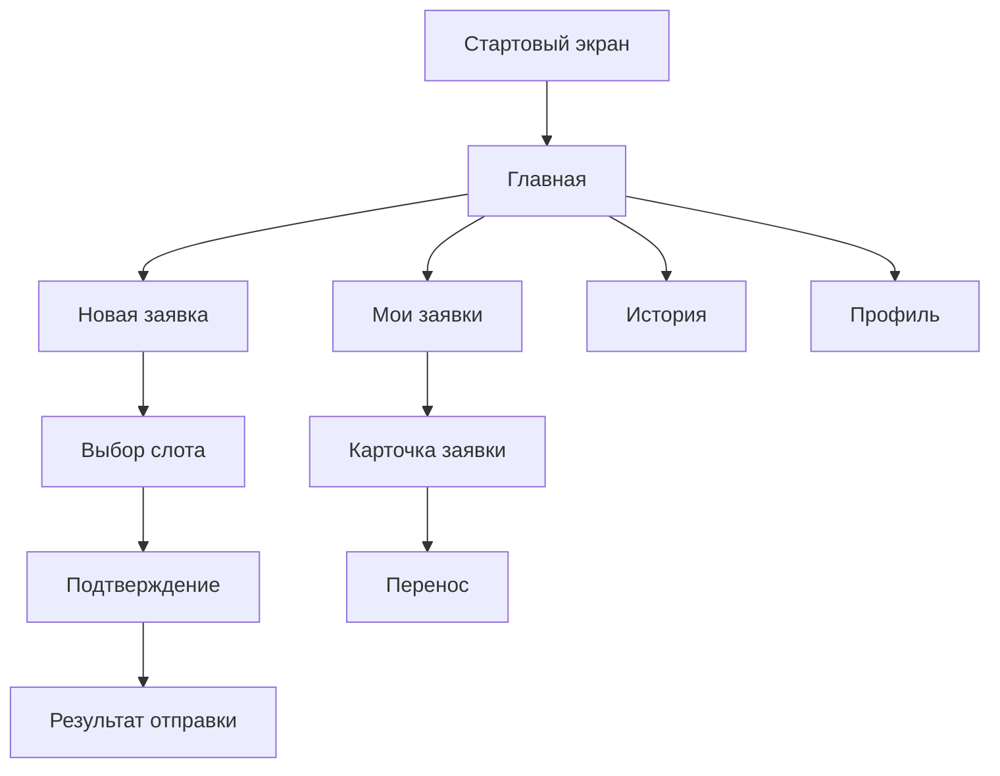
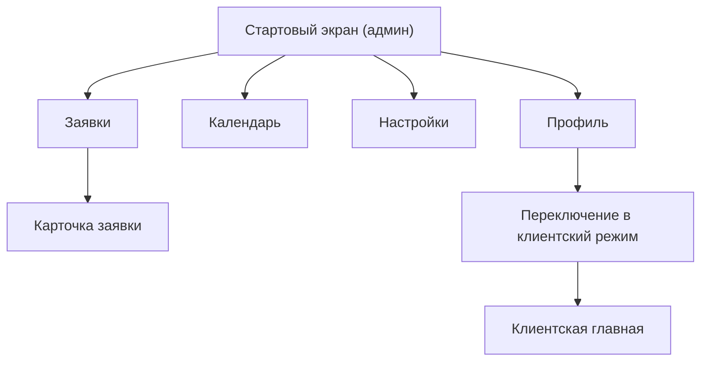

# Структура экранов и переходов для mini-app

## Назначение документа

Этот документ описывает экраны, состояния, основные элементы интерфейса и переходы только для `mini-app`.

Важно:
- документ относится именно к `mini-app`;
- он не описывает bot-only интерфейс;
- он нужен как ориентир для UX, frontend-структуры и API-сценариев.

Связанные документы:
- [Техническое задание для mini-app.md](</Users/elenarazumova/Desktop/Vibe-project/Согласование встреч Google календарь/Техническое задание для mini-app.md>)
- [Архитектура проекта для mini-app.md](</Users/elenarazumova/Desktop/Vibe-project/Согласование встреч Google календарь/Архитектура проекта для mini-app.md>)
- [Этапы разработки для mini-app.md](</Users/elenarazumova/Desktop/Vibe-project/Согласование встреч Google календарь/Этапы разработки для mini-app.md>)
- [Контент и тексты для mini-app.md](</Users/elenarazumova/Desktop/Vibe-project/Согласование встреч Google календарь/Контент и тексты для mini-app.md>)
- [UI-концепция и дизайн-система для mini-app.md](</Users/elenarazumova/Desktop/Vibe-project/Согласование встреч Google календарь/UI-концепция и дизайн-система для mini-app.md>)

## 1. Общие UX-принципы

- mobile-first;
- один общий визуальный стиль для клиента и админа;
- мягкий premium интерфейс;
- короткие понятные тексты;
- всегда понятный путь назад;
- крупные, но не чрезмерные кликабельные зоны;
- минимум перегрузки на одном экране.

## 2. Общая навигация

## 2.1. Для клиента

Нижняя навигация:
- `Главная`
- `Мои заявки`
- `История`
- `Профиль`

## 2.2. Для админа

Нижняя навигация:
- `Заявки`
- `Календарь`
- `Настройки`
- `Профиль`

## 2.3. Для `ADMIN_USER_ID`

Нужен быстрый видимый переключатель:
- `Админ`
- `Клиент`

Переключение должно быть доступно:
- на стартовом экране;
- в профиле;
- без выхода из приложения.

## 3. Общие экраны и состояния

## 3.1. Splash / Loading

### Назначение

Короткий стартовый загрузочный экран при открытии Mini App.

### Что показывает

- логотип или текстовый бренд;
- мягкий фон в фирменной палитре;
- индикатор загрузки.

### Переходы

- если авторизация успешна -> в стартовый экран соответствующей роли;
- если ошибка -> в экран ошибки.

## 3.2. Экран ошибки

### Назначение

Показать, что приложение не смогло загрузиться или авторизоваться.

### Что показывает

- короткий понятный текст;
- кнопку `Попробовать снова`;
- кнопку `Вернуться в бот`, если это возможно.

### Переходы

- `Попробовать снова` -> повторная инициализация;
- `Вернуться в бот` -> fallback-путь.

## 4. Стартовый экран

## 4.1. Назначение

Создать персональное первое впечатление и объяснить, куда попал пользователь.

## 4.2. Состав экрана

- короткое приветствие;
- формулировка в духе `Вы записываетесь к Елене Разумовой`;
- реальное фото;
- блок `Чем могу быть полезна`;
- основная CTA-кнопка:
  - для клиента: `Записаться`
  - для админа: `Перейти к заявкам`
- быстрый переключатель роли для `ADMIN_USER_ID`.

Фактические тексты и структура контентного блока для этого экрана берутся из документа:
- [Контент и тексты для mini-app.md](</Users/elenarazumova/Desktop/Vibe-project/Согласование встреч Google календарь/Контент и тексты для mini-app.md>)

## 4.3. Переходы

- `Записаться` -> экран новой заявки;
- `Перейти к заявкам` -> админский список;
- `Клиент`/`Админ` -> смена режима;
- нижняя навигация -> соответствующий раздел.

## 5. Клиентский контур

## 5.1. Экран `Главная`

### Назначение

Дать быстрый вход в основное действие и показать ближайший контекст.

### Содержимое

- персональное приветствие;
- кнопка `Записаться`;
- карточка ближайшей активной заявки, если она есть;
- виджет `Черновик`, если он есть;
- быстрый доступ к листу ожидания, если актуально.

### Переходы

- `Записаться` -> новая заявка;
- карточка заявки -> карточка активной заявки;
- `Продолжить черновик` -> экран черновика.

## 5.2. Экран `Новая заявка`

### Назначение

Главный клиентский flow записи.

### Структура

Форма с прогрессом и шагами:
1. Имя
2. Тема встречи
3. Формат
4. Длительность
5. Контакты
6. Комментарий
7. Выбор даты и времени
8. Подтверждение

### Важные элементы

- кнопка `Далее`;
- кнопка `Назад`;
- кнопка `Сохранить черновик`;
- визуальный прогресс;
- summary на последнем шаге.

### Переходы

- `Далее` -> следующий шаг;
- `Назад` -> предыдущий шаг;
- `Сохранить черновик` -> сохранить и перейти в подтверждение сохранения/домашний экран;
- `Подтвердить` -> создать заявку;
- успешное завершение -> экран результата / карточка заявки.

## 5.3. Экран выбора слота

### Назначение

Сделать выбор слота максимально наглядным.

### Содержимое

- выбор недели;
- выбор дня;
- выбор времени;
- индикатор выбранного слота;
- пустое состояние `слотов нет`.

### Если слотов нет

Показывать действия:
- `Встать в лист ожидания`;
- `Срочная заявка`, если пользователь не нашел подходящих слотов.

### Переходы

- выбор времени -> возврат в форму с выбранным слотом;
- `Лист ожидания` -> экран/модалка заявки в лист ожидания;
- `Срочная заявка` -> экран/модалка срочной заявки.

## 5.4. Экран результата отправки

### Назначение

Подтвердить, что заявка успешно ушла.

### Содержимое

- статус отправки;
- краткая карточка заявки;
- кнопка `Мои заявки`;
- кнопка `На главную`.

### Переходы

- `Мои заявки` -> экран активных заявок;
- `На главную` -> клиентская главная.

## 5.5. Экран `Мои заявки`

### Назначение

Показать все активные заявки клиента.

### Содержимое

- список карточек;
- статус;
- дата и время;
- формат;
- длительность;
- индикатор наличия ссылки на встречу.

### Переходы

- тап по карточке -> карточка активной заявки.

## 5.6. Карточка активной заявки

### Содержимое

- тема;
- статус;
- дата и время;
- формат;
- длительность;
- контакты;
- комментарий клиента;
- комментарий администратора, если есть;
- блок ссылки на встречу:
  - `ссылка пока не добавлена`
  - или кнопка/ссылка открытия встречи;
- переключатель reminder, если применимо;
- кнопка `Отменить`;
- кнопка `Перенести`.

### Переходы

- `Отменить` -> модалка подтверждения отмены;
- `Перенести` -> flow переноса;
- `Добавить в Google Календарь` после подтверждения -> внешний сценарий открытия Google Calendar.

## 5.7. Экран переноса

### Назначение

Дать пользователю выбрать новый слот для существующей активной заявки.

### Содержимое

- краткая информация о текущей заявке;
- выбор нового слота;
- подтверждение запроса на перенос.

### Переходы

- `Отправить запрос` -> статус ожидания решения;
- `Назад` -> карточка заявки.

## 5.8. Экран `История`

### Назначение

Показать завершенные прошлые встречи.

### Содержимое

- список завершенных карточек;
- дата;
- формат;
- тема;
- итоговый статус.

### Переходы

- тап по карточке -> карточка исторической заявки в режиме чтения.

## 5.9. Карточка исторической заявки

### Содержимое

- краткая информация по встрече;
- финальный статус;
- без быстрых действий.

### Переходы

- `Назад` -> история.

## 5.10. Экран `Профиль`

### Содержимое

- имя;
- email;
- телефон;
- текущий режим;
- переключатель `Клиент / Админ`, если доступно;
- ссылка на черновик, если он есть.

### Переходы

- редактирование контактов -> форма редактирования;
- переключение роли -> соответствующий контур.

## 5.11. Экран `Черновик заявки`

### Назначение

Продолжить ранее сохраненную новую заявку.

### Содержимое

- краткое состояние черновика;
- кнопка `Продолжить`;
- кнопка `Удалить черновик`;
- кнопка `Начать заново`.

### Переходы

- `Продолжить` -> новая заявка с восстановленным состоянием;
- `Удалить черновик` -> подтверждение удаления;
- `Начать заново` -> новая пустая форма.

## 5.12. Экран/модалка `Лист ожидания`

### Назначение

Позволить клиенту оставить запрос на конкретную дату, если слотов нет.

### Содержимое

- выбранная дата;
- необязательный комментарий;
- кнопка `Отправить в лист ожидания`.

### Переходы

- успешная отправка -> экран подтверждения;
- `Назад` -> выбор слота.

## 5.13. Экран/модалка `Срочная заявка`

### Назначение

Позволить отправить отдельную срочную заявку на ручное рассмотрение админом.

### Содержимое

- пояснение, что это ручной сценарий;
- обязательные ключевые поля;
- необязательный комментарий;
- кнопка `Отправить срочную заявку`.

### Переходы

- успешная отправка -> экран подтверждения;
- `Назад` -> предыдущий экран.

## 6. Админский контур

## 6.1. Экран `Заявки`

### Назначение

Главная рабочая точка администратора.

### Содержимое

- список заявок;
- фильтры;
- быстрые табы/переключатели:
  - `Новые`
  - `Ожидают решения`
  - `Переносы`
  - `Ожидание`
  - `Срочные`
- поиск.

### Переходы

- тап по карточке -> карточка заявки;
- смена фильтра -> обновление списка.

## 6.2. Карточка заявки администратора

### Содержимое

- данные клиента;
- тема;
- формат;
- длительность;
- дата и слот;
- статус;
- комментарий клиента;
- поле комментария администратора;
- поле ссылки на встречу;
- кнопки:
  - `Подтвердить`
  - `Отклонить`
  - `Подтвердить перенос`
  - `Отклонить перенос`

### Переходы

- действие по заявке -> обновление статуса и возврат в список или обновленная карточка.

## 6.3. Экран `Календарь`

### Назначение

Дать обзор загруженности по дням.

### Содержимое

- календарная сетка или список дней;
- индикаторы:
  - подтвержденные встречи;
  - ожидающие заявки;
  - закрытые дни.

### Переходы

- тап по дню -> детальный обзор дня или отфильтрованный список заявок.

## 6.4. Деталь дня

### Содержимое

- список встреч и заявок по выбранному дню;
- статусы;
- переход в карточку заявки.

## 6.5. Экран `Настройки`

### Содержимое

- рабочие окна;
- закрытые дни;
- внутренние блоки времени;
- блокировка пользователей.

### Переходы

- каждый раздел открывает отдельный подэкран управления.

## 6.6. Экран `Рабочие окна`

### Содержимое

- текущие weekly-окна;
- разовые окна на дату, если предусмотрены текущим ядром;
- кнопки добавления/редактирования/удаления.

### Переходы

- изменение -> сохранение -> возврат в настройки.

## 6.7. Экран `Закрытые дни`

### Содержимое

- список закрытых дат;
- кнопка закрытия дня;
- кнопка повторного открытия.

## 6.8. Экран `Внутренние блоки`

### Содержимое

- список внутренних блоков;
- создание нового блока;
- удаление или редактирование блока.

## 6.9. Экран `Лист ожидания`

### Содержимое

- список заявок ожидания;
- дата;
- комментарий клиента;
- кнопка `Предложить слот`.

### Переходы

- `Предложить слот` -> форма выбора и отправки слота клиенту.

## 6.10. Экран предложения слота

### Содержимое

- выбранная заявка ожидания;
- доступные слоты;
- кнопка отправки предложения клиенту.

### После отправки

Клиент может:
- принять;
- отклонить.

## 6.11. Экран `Профиль` администратора

### Содержимое

- имя;
- статус администратора;
- переключатель `Админ / Клиент`;
- возможно, служебная информация о доступе.

## 7. Ключевые переходы между контурами

## 7.1. Для обычного клиента

## 7.2. Для `ADMIN_USER_ID`

## 8. Пустые и сервисные состояния

Для ключевых экранов должны быть предусмотрены:
- `loading`;
- `empty`;
- `error`;
- `offline/temporarily unavailable`, если Mini App не может получить данные;
- понятный возврат назад.

Особенно важно это для:
- списка заявок;
- истории;
- календаря;
- листа ожидания;
- выбора слотов.

## 9. Что считать согласованным результатом по UX-структуре

Документ можно считать согласованным, если:
- понятны все основные экраны клиента;
- понятны все основные экраны админа;
- понятны переходы между ними;
- роль `ADMIN_USER_ID` учтена отдельно;
- есть места под черновики, ожидание, срочную заявку, комментарий и ссылку на встречу;
- структура экрана не противоречит ТЗ и архитектуре.
