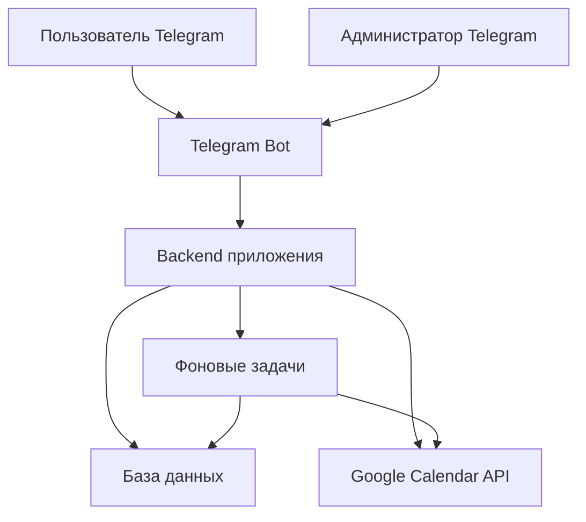

# Этапы разработки

## Назначение документа

Этот документ нужен как рабочая карта реализации проекта `Запись на встречу` на основе [Техническое задание.md](</Users/elenarazumova/Desktop/Vibe-project/Согласование встреч Google календарь/Техническое задание.md>).

Документ решает 4 задачи:
- фиксирует рекомендуемую архитектуру проекта;
- фиксирует рекомендуемый стек технологий;
- предлагает структуру кода и модулей;
- раскладывает разработку на логичные этапы, каждый из которых можно отдавать нейросети как отдельное мини-ТЗ.

## Чек-лист прогресса по проекту

Этот блок нужен как общий трекер прогресса. Его можно обновлять вручную по мере выполнения этапов.

### Статусы

- `[ ]` не начато
- `[~]` в работе
- `[x]` завершено
- `[!]` требует доработки или повторной проверки

### Общий прогресс по этапам

- `[x]` Этап 0. Подготовка окружения и техническая основа
- `[x]` Этап 1. Каркас приложения, конфиг, база и логирование
- `[x]` Этап 2. Базовый Telegram-бот и роли
- `[x]` Этап 3. Модель данных заявок и FSM-сценарий создания заявки
- `[x]` Этап 4. Движок доступности и расчет слотов
- `[x]` Этап 5. Выбор слота, удержание и отправка заявки администратору
- `[x]` Этап 6. Админ-обработка заявки и интеграция с Google Calendar
- `[x]` Этап 7. Пользовательские действия после создания заявки
- `[x]` Этап 8. Админ-функции управления доступностью и пользователями
- `[x]` Этап 9. Фоновые задачи, TTL и очистка истории
- `[x]` Этап 10. Интеграционное тестирование, стабилизация и подготовка к реальному использованию

### Как пользоваться чек-листом

- Перед началом этапа меняйте статус нужного этапа на `[~]`.
- После завершения этапа и всех проверок меняйте статус на `[x]`.
- Если этап реализован частично или в нем нашли баги, ставьте `[!]`.
- Внутри каждого этапа ниже есть отдельный чек-лист завершения, его тоже можно отмечать вручную.

Ключевой принцип: сначала согласовать устройство системы, только потом писать код.

## Как использовать этот документ при работе с нейросетями

- Реализовывать проект нужно строго по этапам, не перепрыгивая через фундамент.
- На каждом этапе нужно просить нейросеть делать только этот этап, без самовольного захвата следующих.
- На каждом этапе нейросеть должна не только написать код, но и сама выполнить максимум проверок.
- Если какая-то проверка без участия владельца Telegram-аккаунта или Google Calendar невозможна, нейросеть должна дать вам короткую и пошаговую инструкцию проверки без сложных технических терминов.
- На каждом этапе должны быть добавлены логи, чтобы при проблемах можно было быстро понять, что сломалось.
- После завершения каждого этапа нейросеть должна отдавать:
- что реализовано;
- какие файлы созданы или изменены;
- какие автоматические проверки выполнены;
- какие логи посмотреть;
- что и как проверить вручную;
- что считать критерием готовности этапа.

## Архитектурные принципы

- MVP должен быть простым для локального запуска на вашем компьютере.
- Архитектура должна быть пригодна для дальнейшего перехода в `Telegram Mini App`.
- Бизнес-логика не должна быть смешана с Telegram-хендлерами и кодом интеграции с Google Calendar.
- Все ключевые сущности и статусы должны храниться в базе данных, а не только в памяти.
- Любые действия, влияющие на календарь и доступность слотов, должны логироваться.
- Проверка доступности слота должна выполняться повторно в момент подтверждения администратором.
- Выбранный стек не должен требовать сложной инфраструктуры для локального MVP.

## Рекомендуемая архитектура проекта

### Общая схема



### Архитектурные слои

#### 1. Presentation layer
Слой общения с внешним миром.

Сюда входят:
- Telegram-бот;
- команды;
- inline-кнопки;
- сценарии ввода данных;
- административное меню.

Что важно:
- этот слой только принимает ввод пользователя и показывает ответ;
- в нем не должно быть сложной бизнес-логики по слотам, статусам и календарю.

#### 2. Application layer
Слой сценариев и правил работы системы.

Сюда входят:
- создание заявки;
- перенос;
- отмена;
- подтверждение;
- отклонение;
- блокировка пользователя;
- закрытие дня;
- создание внутренних блоков времени;
- расчет того, какие шаги разрешены в текущем статусе.

Что важно:
- именно здесь живет основная логика проекта;
- этот слой должен быть независим от Telegram и Google Calendar насколько это возможно.

#### 3. Domain layer
Слой предметной модели.

Сюда входят:
- сущности `User`, `Booking`, `AvailabilityRule`, `ClosedDate`, `TimeBlock`, `StatusHistory`;
- статусы заявок;
- ограничения по 7 активным заявкам;
- лимит 4 встречи в день;
- TTL 72 часа;
- правила переноса и освобождения слотов.

Что важно:
- здесь задаются правила, которые не должны ломаться при смене интерфейса;
- именно этот слой пригодится потом при переходе к Mini App.

#### 4. Infrastructure layer
Слой работы с внешними системами.

Сюда входят:
- база данных;
- репозитории;
- интеграция с Google Calendar;
- фоновые задачи;
- конфигурация;
- логирование.

Что важно:
- если потом локальная база будет заменена на серверную, бизнес-логика не должна переписываться с нуля;
- если Telegram-бот дополняется Mini App API, основная логика должна остаться прежней.

## Рекомендуемый стек технологий

### Основной стек MVP

- `Python 3.12`
- `aiogram 3`
- `SQLAlchemy 2`
- `Alembic`
- `SQLite` для локального MVP
- `APScheduler`
- `Pydantic Settings`
- `google-api-python-client`
- `google-auth`
- `pytest`
- `pytest-asyncio`
- стандартный модуль `logging`

### Почему именно такой стек

#### Python 3.12
- очень хорошо подходит для Telegram-ботов;
- простой для генерации кода через нейросети;
- огромная экосистема;
- легко найти примеры и исправлять ошибки.

#### aiogram 3
- один из самых удобных современных фреймворков для Telegram-ботов на Python;
- хорошо поддерживает FSM-сценарии;
- удобно строить пошаговые анкеты и админ-меню;
- подходит и для простого бота, и для дальнейшего роста.

#### SQLAlchemy 2
- зрелый и надежный доступ к базе;
- хорошо подходит для разделения бизнес-логики и хранения данных;
- позволяет потом относительно спокойно перейти с SQLite на PostgreSQL.

#### Alembic
- нужен для миграций базы данных;
- позволяет не менять структуру таблиц вручную;
- делает развитие проекта аккуратным и воспроизводимым.

#### SQLite для локального MVP
- самый простой вариант для старта на вашем компьютере;
- не требует отдельного сервера базы данных;
- подходит для личного бота с низкой нагрузкой;
- при этом архитектуру нужно делать так, чтобы потом перейти на `PostgreSQL`.

#### APScheduler
- нужен для фоновых задач;
- подходит для автоотмены заявок через 72 часа;
- подходит для периодической очистки старых записей;
- не требует отдельной тяжелой инфраструктуры на старте.

#### Pydantic Settings
- нужен для аккуратной загрузки настроек из `.env`;
- позволяет не хранить токены и секреты прямо в коде.

#### Google Calendar API client
- официальный способ работать с Google Calendar;
- позволяет создавать, обновлять и удалять события;
- позволяет добавлять гостя по email;
- позволяет надежно синхронизировать подтвержденные встречи.

#### pytest и pytest-asyncio
- нужны для автоматических проверок;
- позволяют проверять бизнес-логику без ручного кликанья в Telegram;
- особенно важны для расчета слотов, ограничений, статусов и TTL.

#### logging
- нужен для быстрой диагностики проблем;
- должен быть включен с самого начала проекта;
- логи для MVP лучше делать простыми и читаемыми, а не слишком сложными.

## Рекомендуемый способ авторизации в Google Calendar

Для вашего случая рекомендуется использовать `service account`, а не пользовательский OAuth.

### Почему это лучший вариант для MVP

- календарь только один, ваш;
- боту не нужно запрашивать доступ к календарям других людей;
- не нужно каждый раз вручную обновлять доступ;
- такой вариант проще для локального запуска и будущего переноса на сервер.

### Как это работает

1. Создается `service account` в Google Cloud.
2. У сервисного аккаунта появляется служебный email.
3. Ваш Google Calendar расшаривается на этот email с правом изменения событий.
4. Бот использует JSON-ключ сервисного аккаунта и работает с вашим календарем.

### Что важно предусмотреть

- email гостя добавляется в событие только если пользователь указал email;
- доступ к вашему реальному Google-аккаунту пользователю не раскрывается;
- `calendar_id` должен храниться в настройках;
- JSON-ключ нельзя хранить в репозитории.

## Рекомендуемый режим запуска MVP

### Для первой версии

- Telegram-бот работает через `long polling`.
- Приложение запускается локально на вашем компьютере.
- База данных локальная, файл `SQLite`.
- Планировщик фоновых задач работает внутри приложения.

### Почему так

- не нужен публичный сервер и HTTPS уже на старте;
- проще отлаживать;
- проще запускать и останавливать;
- для вашего подготовительного этапа это самый спокойный вариант.

### Что заложить на будущее

- later-ready структура для перехода на webhook;
- later-ready структура для подключения `FastAPI` в Mini App этапе;
- отделение бизнес-логики от транспорта.

## Рекомендуемая структура проекта

```text
project/
  README.md
  .env.example
  pyproject.toml
  alembic.ini
  logs/
  migrations/
  src/
    app/
      main.py
      config.py
      logging_config.py
      bot/
        handlers/
        keyboards/
        middlewares/
        states/
      application/
        services/
        use_cases/
      domain/
        models/
        enums/
        rules/
      infrastructure/
        db/
          models/
          repositories/
          session.py
        calendar/
        scheduler/
      modules/
        bookings/
        users/
        availability/
        admin/
        notifications/
      utils/
  tests/
    unit/
    integration/
    e2e/
  docs/
```

## Что должно лежать в ключевых модулях

### `bot/`
- Telegram-хендлеры;
- FSM-сценарии;
- кнопки;
- разруливание входящих команд.

### `application/`
- use case-сценарии;
- orchestration-логика;
- проверки допустимых действий.

### `domain/`
- статусы;
- сущности;
- правила лимитов;
- расчеты доступности.

### `infrastructure/db/`
- модели БД;
- миграции;
- репозитории.

### `infrastructure/calendar/`
- клиент Google Calendar;
- адаптер создания, обновления и удаления событий;
- повторные проверки и нормализация ошибок.

### `infrastructure/scheduler/`
- задачи автоотмены;
- задачи очистки истории;
- периодические сервисные задачи.

### `modules/`
- группировка бизнес-областей по смыслу, чтобы проект не расползался.

## Логирование и диагностика

Логи нужно включать с первого этапа.

### Обязательные требования к логам

- Все логи должны писаться и в консоль, и в файл.
- Должен быть отдельный файл для ошибок.
- Формат логов должен быть читаемым человеком.
- У каждого важного действия должен быть контекст.

### Что обязательно писать в логах

- время;
- уровень логирования;
- имя модуля;
- `telegram_user_id`, если действие связано с пользователем;
- `booking_id`, если действие связано с заявкой;
- старый и новый статус, если меняется статус;
- `calendar_event_id`, если идет работа с Google Calendar;
- причина ошибки;
- трассировка исключения для ошибок.

### Минимальные уровни логов

- `INFO` для обычных действий;
- `WARNING` для спорных ситуаций;
- `ERROR` для сбоев;
- `DEBUG` можно включать локально при разборе проблем.

### Ключевые события, которые обязательно логировать

- старт и остановка приложения;
- подключение к базе;
- запуск планировщика;
- входящие команды;
- создание заявки;
- выбор слота;
- удержание слота;
- подтверждение;
- отклонение;
- отмена;
- перенос;
- закрытие дня;
- блокировка пользователя;
- создание, обновление и удаление событий Google Calendar;
- автоотмена по TTL;
- очистка старых записей;
- ошибки внешних интеграций.

## Правила проверки на каждом этапе

- Нейросеть должна сначала запускать автоматические проверки сама.
- Если этап можно проверить тестами, тесты обязательны.
- Если этап можно проверить локальным smoke-тестом, он обязателен.
- Если этап зависит от Telegram или Google Calendar, нужно выполнить ручную проверку через реальные сценарии.
- После каждого этапа нужно кратко просматривать лог-файлы и убеждаться, что там нет неожиданных ошибок.

## Этап 0. Подготовка окружения и техническая основа

### Цель этапа
Подготовить все внешние доступы и договориться о технических правилах проекта до написания основной логики.

### Что реализуется на этапе

- структура репозитория;
- `.env.example`;
- список обязательных переменных окружения;
- договоренность по имени бота, `admin_user_id`, `calendar_id`;
- получение Telegram bot token;
- создание Google Cloud проекта;
- создание `service account`;
- выдача сервисному аккаунту доступа к вашему календарю;
- выбор режима локального запуска;
- базовый README с инструкцией запуска.

### Какие настройки должны быть в `.env`

- `BOT_TOKEN`
- `ADMIN_USER_ID`
- `TIMEZONE=Europe/Moscow`
- `GOOGLE_CALENDAR_ID`
- `GOOGLE_SERVICE_ACCOUNT_FILE`
- `DATABASE_URL`
- `LOG_LEVEL`

### Логи, которые должны быть предусмотрены

- лог загрузки конфигурации без вывода секретов;
- лог успешной проверки обязательных настроек;
- лог ошибок при отсутствии обязательных переменных.

### Что нейросеть должна проверить сама

- что список переменных окружения полный;
- что структура проекта непротиворечива;
- что README соответствует выбранному способу запуска;
- что секреты не хардкодятся в коде и не попадают в git.

### Что проверить вам

1. Убедиться, что бот создан через `BotFather`.
2. Убедиться, что у вас есть `BOT_TOKEN`.
3. Убедиться, что сервисный аккаунт создан.
4. Убедиться, что ваш календарь расшарен на email сервисного аккаунта.
5. Убедиться, что подготовлен файл JSON-ключа сервисного аккаунта.

### Критерий готовности этапа

- все внешние доступы подготовлены;
- список настроек финально понятен;
- можно переходить к коду без организационных блокеров.

### Чек-лист завершения этапа

- `[ ]` Подготовлена структура репозитория
- `[ ]` Подготовлен `.env.example`
- `[ ]` Зафиксирован список обязательных переменных окружения
- `[ ]` Подготовлен README с базовыми шагами запуска
- `[ ]` Получен `BOT_TOKEN`
- `[ ]` Создан `service account`
- `[ ]` Календарь выдан в доступ сервисному аккаунту
- `[ ]` Подготовлен JSON-ключ сервисного аккаунта
- `[ ]` Нейросеть выполнила свои проверки
- `[ ]` Вы выполнили ручную проверку
- `[ ]` Этап можно считать завершенным

## Этап 1. Каркас приложения, конфиг, база и логирование

### Цель этапа
Собрать технический фундамент проекта, на котором дальше будет строиться вся логика.

### Что реализуется на этапе

- стартовый каркас Python-проекта;
- загрузка настроек из `.env`;
- инициализация логирования;
- подключение к SQLite;
- базовая схема БД;
- настройка миграций Alembic;
- команды запуска приложения;
- health-check или простая сервисная самопроверка при старте.

### Какие сущности уже должны быть подготовлены

- `users`
- `bookings`
- `status_history`
- `availability_rules`
- `closed_dates`
- `time_blocks`

### Логи этапа

- успешный старт приложения;
- путь к базе данных;
- успешное подключение к БД;
- применение миграций;
- ошибки конфигурации;
- ошибки подключения к БД.

### Что нейросеть должна проверить сама

- приложение стартует без ошибок;
- миграции создаются и применяются;
- таблицы реально появляются в базе;
- лог-файлы создаются;
- тест на загрузку конфигурации проходит;
- тест на подключение к БД проходит.

### Что проверить вам

1. Запустить проект по инструкции.
2. Убедиться, что приложение стартует без красных ошибок.
3. Проверить, что появилась папка `logs`.
4. Проверить, что в логах есть запись о старте.
5. Проверить, что создан файл базы данных.

### Критерий готовности этапа

- проект стабильно стартует локально;
- база подключается;
- миграции работают;
- логи пишутся корректно.

### Чек-лист завершения этапа

- `[ ]` Создан стартовый каркас проекта
- `[ ]` Настройки читаются из `.env`
- `[ ]` Работает логирование в консоль и файлы
- `[ ]` Подключена SQLite-база
- `[ ]` Созданы базовые сущности БД
- `[ ]` Настроен Alembic
- `[ ]` Приложение стартует без ошибок
- `[ ]` Логи реально создаются
- `[ ]` Нейросеть прогнала автоматические проверки
- `[ ]` Вы выполнили ручную проверку
- `[ ]` Этап можно считать завершенным

## Этап 2. Базовый Telegram-бот и роли

### Цель этапа
Поднять рабочий бот, который умеет запускаться, отвечать на базовые команды и различать пользователя и администратора.

### Что реализуется на этапе

- подключение `aiogram`;
- команда `/start`;
- определение администратора по `admin_user_id`;
- базовое меню пользователя;
- базовое меню администратора;
- единая точка входа в будущие сценарии;
- защита админ-команд от обычных пользователей.

### Что еще важно сделать

- показать пользователю понятный стартовый текст;
- показать администратору админское меню;
- сохранить пользователя в базе при первом входе;
- логировать каждую команду `/start`.

### Логи этапа

- получение апдейта от Telegram;
- новый пользователь в системе;
- вход администратора;
- отклонение доступа к админ-функции для обычного пользователя;
- ошибки хендлеров.

### Что нейросеть должна проверить сама

- бот успешно запускается в `long polling`;
- тесты на определение роли проходят;
- тесты на первый вход пользователя проходят;
- smoke-проверка основных команд проходит;
- в логах нет необработанных исключений.

### Что проверить вам

1. Открыть бота в Telegram.
2. Нажать `Start`.
3. Проверить, что бот отвечает.
4. Проверить, что вы как администратор видите админ-пункты.
5. Проверить с другого аккаунта, что обычный пользователь админ-пункты не видит.

### Критерий готовности этапа

- бот работает в Telegram;
- пользователи сохраняются;
- роли различаются правильно;
- админские функции защищены.

### Чек-лист завершения этапа

- `[ ]` Подключен `aiogram 3`
- `[ ]` Работает запуск через `long polling`
- `[ ]` Реализована команда `/start`
- `[ ]` Администратор определяется по `admin_user_id`
- `[ ]` Есть базовое меню пользователя
- `[ ]` Есть базовое меню администратора
- `[ ]` Обычный пользователь не видит админ-действия
- `[ ]` Пользователь сохраняется при первом входе
- `[ ]` Добавлены базовые логи Telegram-действий
- `[ ]` Нейросеть прогнала автоматические проверки
- `[ ]` Вы проверили бота вручную в Telegram
- `[ ]` Этап можно считать завершенным

## Этап 3. Модель данных заявок и FSM-сценарий создания заявки

### Цель этапа
Собрать полностью рабочий сценарий создания заявки без еще сложной интеграции со слотами.

### Что реализуется на этапе

- FSM-сценарий записи;
- ввод имени с автоподстановкой из Telegram;
- редактирование имени;
- ввод темы встречи;
- выбор формата;
- выбор длительности;
- необязательный email;
- необязательный комментарий;
- обязательный альтернативный контакт при отсутствии `username`;
- сохранение черновика заявки в базе;
- валидация обязательных полей;
- команда или кнопка просмотра своих активных заявок;
- карточка заявки без действий, если слот еще не встроен на этом этапе.

### Логи этапа

- начало сценария создания заявки;
- переходы между состояниями FSM;
- сохранение черновика;
- ошибка валидации поля;
- попытка завершить сценарий без обязательных данных.

### Что нейросеть должна проверить сама

- тесты FSM-сценария на полный путь заполнения проходят;
- тест на пользователя без `username` проходит;
- тест на валидацию обязательных полей проходит;
- список активных заявок открывается без ошибок;
- черновики и данные реально сохраняются в базе.

### Что проверить вам

1. Пройти сценарий создания заявки до конца.
2. Проверить, что имя подтянулось автоматически.
3. Изменить имя и убедиться, что изменение принимается.
4. Проверить, что email можно пропустить.
5. Проверить, что комментарий можно пропустить.
6. Если есть тестовый аккаунт без `username`, проверить, что бот просит телефон или email.
7. Открыть список своих заявок и проверить, что новая заявка там отображается.

### Критерий готовности этапа

- пользователь может без ошибок пройти анкету;
- все поля корректно сохраняются;
- сценарий устойчив к пустым и некорректным вводам.

### Чек-лист завершения этапа

- `[ ]` Реализован FSM-сценарий записи
- `[ ]` Имя подставляется из Telegram
- `[ ]` Имя можно редактировать
- `[ ]` Обрабатывается тема встречи
- `[ ]` Обрабатывается формат встречи
- `[ ]` Обрабатывается длительность
- `[ ]` Email можно указать как необязательный
- `[ ]` Комментарий можно пропустить
- `[ ]` При отсутствии `username` запрашивается альтернативный контакт
- `[ ]` Черновик заявки сохраняется в базу
- `[ ]` Пользователь видит список своих активных заявок
- `[ ]` Нейросеть прогнала автоматические проверки
- `[ ]` Вы проверили сценарий вручную
- `[ ]` Этап можно считать завершенным

## Этап 4. Движок доступности и расчет слотов

### Цель этапа
Реализовать отдельный надежный механизм расчета доступных слотов по правилам ТЗ.

### Что реализуется на этапе

- хранение правил доступности;
- рабочие дни `пн-пт`;
- окна `10:00-12:00` и `14:00-16:00`;
- шаг `30 минут`;
- горизонт `35 дней`;
- минимальный срок подачи заявки `1 час`;
- лимит `4` встречи в день;
- учет закрытых дат;
- учет внутренних блоков времени;
- учет уже удерживаемых слотов;
- учет занятых слотов из базы;
- подготовка адаптера для учета событий Google Calendar.

### Что особенно важно

- расчет слотов должен быть отдельным сервисом;
- логика не должна быть зашита внутрь Telegram-хендлеров;
- алгоритм должен покрываться тестами отдельно от интерфейса.

### Логи этапа

- запрос расчета слотов;
- параметры расчета;
- причина исключения слота;
- итоговое количество доступных слотов;
- ошибки расчета.

### Что нейросеть должна проверить сама

- unit-тесты на расчет слотов проходят;
- тесты на горизонт записи проходят;
- тесты на минимальный срок подачи заявки проходят;
- тесты на лимит 4 встречи в день проходят;
- тесты на закрытую дату и внутренний блок проходят;
- тесты на удержанный слот проходят.

### Что проверить вам

1. Попросить нейросеть показать примеры рассчитанных слотов на несколько дат.
2. Проверить глазами, что бот не предлагает выходные.
3. Проверить, что время отображается в `MSK`.
4. Проверить, что слоты начинаются по шагу `30 минут`.
5. Проверить, что при закрытой дате слоты не показываются.

### Критерий готовности этапа

- движок слотов проходит тесты;
- правила из ТЗ соблюдаются;
- сервис готов к подключению в реальный сценарий записи.

### Чек-лист завершения этапа

- `[ ]` Реализованы рабочие дни `пн-пт`
- `[ ]` Реализованы окна `10:00-12:00` и `14:00-16:00`
- `[ ]` Реализован шаг `30 минут`
- `[ ]` Реализован горизонт `35 дней`
- `[ ]` Реализован минимальный срок подачи `1 час`
- `[ ]` Реализован лимит `4` встречи в день
- `[ ]` Учитываются закрытые даты
- `[ ]` Учитываются внутренние блоки времени
- `[ ]` Учитываются удерживаемые слоты
- `[ ]` Сервис расчета слотов отделен от Telegram-слоя
- `[ ]` Нейросеть прогнала unit-тесты
- `[ ]` Вы проверили слоты глазами
- `[ ]` Этап можно считать завершенным

## Этап 5. Выбор слота, удержание и отправка заявки администратору

### Цель этапа
Связать сценарий создания заявки с реальными слотами и довести процесс до статуса `ожидает решения`.

### Что реализуется на этапе

- показ пользователю доступных слотов;
- выбор одного слота;
- повторная проверка доступности при выборе;
- удержание слота;
- перевод заявки из черновика в `ожидает решения`;
- запись TTL 72 часа;
- отправка уведомления администратору;
- просмотр пользователем своих активных заявок уже с реальным слотом и статусом.

### Что важно проверить в логике

- один слот не должен выдаваться двум пользователям;
- нельзя обойти лимит активных заявок;
- нельзя отправить неполную заявку;
- удержание должно переживать повторные открытия меню.

### Логи этапа

- выбор слота;
- успешное удержание;
- отказ в удержании из-за конфликта;
- создание заявки в статусе `ожидает решения`;
- отправка уведомления администратору.

### Что нейросеть должна проверить сама

- интеграционные тесты на удержание слота проходят;
- тест на конфликт двух пользователей проходит;
- тест на лимит 7 активных заявок проходит;
- тест на отправку уведомления администратору проходит;
- smoke-тест полного пользовательского сценария проходит.

### Что проверить вам

1. Создать заявку и выбрать слот.
2. Проверить, что бот сообщает об отправке на согласование.
3. Проверить, что вам как администратору пришло уведомление.
4. Попробовать с другого аккаунта выбрать тот же слот.
5. Проверить, что слот уже недоступен.

### Критерий готовности этапа

- пользователь может полностью отправить заявку;
- администратор получает уведомление;
- слот надежно удерживается системой.

### Чек-лист завершения этапа

- `[ ]` Пользователю показываются доступные слоты
- `[ ]` Пользователь может выбрать один слот
- `[ ]` Слот повторно проверяется в момент выбора
- `[ ]` Слот удерживается системой
- `[ ]` Заявка переходит в статус `ожидает решения`
- `[ ]` Записывается TTL `72 часа`
- `[ ]` Администратор получает уведомление
- `[ ]` Пользователь видит слот и статус в своих заявках
- `[ ]` Проверен конфликт одного слота для двух пользователей
- `[ ]` Проверен лимит `7` активных заявок
- `[ ]` Нейросеть прогнала интеграционные проверки
- `[ ]` Вы проверили сценарий вручную
- `[ ]` Этап можно считать завершенным

## Этап 6. Админ-обработка заявки и интеграция с Google Calendar

### Цель этапа
Реализовать самое критичное ядро MVP: подтверждение, отклонение и создание событий в Google Calendar.

### Что реализуется на этапе

- карточка заявки для администратора;
- кнопки `Подтвердить` и `Отклонить`;
- повторная проверка доступности слота перед подтверждением;
- создание события в Google Calendar;
- добавление гостя по email;
- сохранение `calendar_event_id`;
- отклонение с освобождением слота;
- уведомление пользователя о результате;
- запись истории статусов.

### Что важно предусмотреть

- заявка не должна считаться подтвержденной, если Google Calendar не создал событие;
- ошибки Google Calendar должны быть читаемо логированы;
- в событие нужно записывать все согласованные поля из ТЗ.

### Логи этапа

- открытие админской карточки;
- подтверждение заявки;
- отклонение заявки;
- вызов Google Calendar API;
- успешное создание события;
- ошибка создания события;
- освобождение слота.

### Что нейросеть должна проверить сама

- интеграционные тесты use case подтверждения проходят;
- тест на отклонение проходит;
- мок-тест Google Calendar клиента проходит;
- тест на недоступный слот перед подтверждением проходит;
- тест на сохранение `calendar_event_id` проходит;
- лог ошибок календаря создается корректно.

### Что проверить вам

1. Создать тестовую заявку.
2. Подтвердить ее из админского меню.
3. Проверить, что пользователю пришло подтверждение.
4. Открыть ваш Google Calendar.
5. Убедиться, что событие появилось в нужное время.
6. Если был указан email, убедиться, что он добавлен как гость.
7. Создать вторую заявку и отклонить ее.
8. Проверить, что слот после отклонения снова доступен.

### Критерий готовности этапа

- подтверждение создает событие в Google Calendar;
- отклонение освобождает слот;
- статусы и уведомления работают корректно.

### Чек-лист завершения этапа

- `[ ]` Есть админская карточка заявки
- `[ ]` Работает действие `Подтвердить`
- `[ ]` Работает действие `Отклонить`
- `[ ]` Перед подтверждением идет повторная проверка слота
- `[ ]` Событие создается в Google Calendar
- `[ ]` При наличии email пользователь добавляется как гость
- `[ ]` Сохраняется `calendar_event_id`
- `[ ]` При отклонении слот освобождается
- `[ ]` Пользователь получает уведомление о результате
- `[ ]` История статусов сохраняется
- `[ ]` Нейросеть прогнала проверки и моки интеграции
- `[ ]` Вы проверили создание события в календаре
- `[ ]` Этап можно считать завершенным

## Этап 7. Пользовательские действия после создания заявки

### Цель этапа
Дать пользователю самостоятельные действия по уже созданным заявкам: просмотр, отмена и перенос.

### Что реализуется на этапе

- список активных заявок;
- карточка заявки;
- кнопка `Отменить`;
- кнопка `Перенести`;
- удаление события из Google Calendar при отмене подтвержденной встречи;
- сценарий выбора нового слота при переносе;
- удержание нового слота;
- сохранение старого слота до решения администратора;
- уведомление администратору о запросе на перенос.

### Логи этапа

- открытие списка заявок;
- отмена пользователем;
- удаление события из Google Calendar;
- запуск переноса;
- удержание нового слота при переносе;
- уведомление администратора о переносе.

### Что нейросеть должна проверить сама

- тест на просмотр списка заявок проходит;
- тест на отмену подтвержденной заявки проходит;
- тест на удаление календарного события проходит;
- тест на запрос переноса проходит;
- тест на сохранение старого слота до решения проходит.

### Что проверить вам

1. Открыть список своих заявок.
2. Проверить, что у каждой заявки видны основные данные.
3. Отменить подтвержденную встречу.
4. Проверить, что событие исчезло из Google Calendar.
5. Создать новую встречу и запросить перенос.
6. Проверить, что у вас как у администратора пришло уведомление о переносе.

### Критерий готовности этапа

- пользователь управляет своими заявками без ручной помощи администратора;
- отмена и перенос работают надежно и прозрачно.

### Чек-лист завершения этапа

- `[ ]` Пользователь видит список активных заявок
- `[ ]` Пользователь может открыть карточку заявки
- `[ ]` Пользователь может отменить заявку
- `[ ]` При отмене подтвержденной встречи событие удаляется из календаря
- `[ ]` Пользователь может запросить перенос
- `[ ]` Пользователь может выбрать новый слот
- `[ ]` Новый слот удерживается
- `[ ]` Старый слот сохраняется до решения администратора
- `[ ]` Администратор получает уведомление о переносе
- `[ ]` История статусов обновляется корректно
- `[ ]` Нейросеть прогнала проверки
- `[ ]` Вы проверили отмену и перенос вручную
- `[ ]` Этап можно считать завершенным

## Этап 8. Админ-функции управления доступностью и пользователями

### Цель этапа
Реализовать административные инструменты управления расписанием и безопасностью.

### Что реализуется на этапе

- настройка рабочих окон;
- настройка минимального времени подачи заявки;
- закрытие даты;
- создание внутреннего блока времени;
- поиск заявок;
- фильтры по статусу, дате, имени, email, Telegram user ID;
- блокировка пользователя;
- разблокировка пользователя;
- массовая отмена будущих встреч пользователя при блокировке;
- удаление его будущих подтвержденных событий из Google Calendar;
- кнопка `Выбрать другое время` после отмены из-за закрытия дня.

### Логи этапа

- изменение настроек доступности;
- закрытие дня;
- создание внутреннего блока;
- поиск и фильтрация;
- блокировка;
- разблокировка;
- массовая отмена;
- удаление связанных событий из Google Calendar.

### Что нейросеть должна проверить сама

- тесты на закрытие дня проходят;
- тест на массовую отмену проходит;
- тест на блокировку пользователя проходит;
- тест на удаление будущих событий при блокировке проходит;
- тест на применение нового минимального срока подачи заявки проходит;
- smoke-тест админских фильтров проходит.

### Что проверить вам

1. Закрыть день, на который уже есть встреча.
2. Проверить, что пользователь получил сообщение об отмене.
3. Проверить, что появляется кнопка `Выбрать другое время`.
4. Нажать эту кнопку и убедиться, что начинается перенос с сохранением данных.
5. Заблокировать тестового пользователя.
6. Проверить, что он больше не может создать новую заявку.
7. Проверить, что его будущие встречи удалены из календаря.

### Критерий готовности этапа

- администратор управляет доступностью без ручного вмешательства в код;
- блокировка и массовые отмены работают корректно.

### Чек-лист завершения этапа

- `[ ]` Администратор может менять рабочие окна
- `[ ]` Администратор может менять минимальный срок подачи заявки
- `[ ]` Администратор может закрывать даты
- `[ ]` Администратор может создавать внутренние блоки времени
- `[ ]` Работают поиск и фильтры по заявкам
- `[ ]` Работает блокировка пользователя
- `[ ]` Работает разблокировка пользователя
- `[ ]` При блокировке отменяются будущие заявки пользователя
- `[ ]` При блокировке удаляются будущие события из календаря
- `[ ]` После закрытия дня пользователь получает `Выбрать другое время`
- `[ ]` Нейросеть прогнала проверки
- `[ ]` Вы проверили массовые отмены и блокировку вручную
- `[ ]` Этап можно считать завершенным

## Этап 9. Фоновые задачи, TTL и очистка истории

### Цель этапа
Сделать систему устойчивой без постоянного ручного контроля.

### Что реализуется на этапе

- автоотмена заявок через 72 часа;
- освобождение слота после автоотмены;
- уведомление пользователя об автоотмене;
- очистка истории статусов старше 30 дней;
- логирование запуска и результата фоновых задач;
- безопасный повторный запуск задач без дублей.

### Логи этапа

- старт планировщика;
- запуск задачи автоотмены;
- количество найденных просроченных заявок;
- автоотмена конкретной заявки;
- очистка старых записей;
- ошибки фоновых задач.

### Что нейросеть должна проверить сама

- тест на автоотмену через TTL проходит;
- тест на освобождение слота проходит;
- тест на уведомление пользователя проходит;
- тест на очистку старой истории проходит;
- повторный запуск планировщика не создает дублей обработки.

### Что проверить вам

1. Попросить нейросеть временно настроить короткий TTL для тестовой проверки на локальной ветке.
2. Создать тестовую заявку.
3. Подождать, пока истечет короткий тестовый TTL.
4. Проверить, что заявка автоматически отменилась.
5. Проверить, что слот снова доступен.
6. Проверить, что в логах есть запись об автоотмене.

### Критерий готовности этапа

- система сама снимает просроченные заявки;
- история очищается;
- фоновые задачи не требуют ручного контроля.

### Чек-лист завершения этапа

- `[ ]` Работает автоотмена по TTL `72 часа`
- `[ ]` После автоотмены слот освобождается
- `[ ]` Пользователь получает уведомление об автоотмене
- `[ ]` Работает очистка истории старше `30 дней`
- `[ ]` Планировщик запускается корректно
- `[ ]` Планировщик не создает дублей обработки
- `[ ]` Фоновые задачи подробно логируются
- `[ ]` Нейросеть прогнала проверки
- `[ ]` Вы проверили автоотмену вручную
- `[ ]` Этап можно считать завершенным

## Этап 10. Интеграционное тестирование, стабилизация и подготовка к реальному использованию

### Цель этапа
Проверить, что система работает как цельный продукт, а не как набор отдельных функций.

### Что реализуется на этапе

- сквозные интеграционные тесты ключевых сценариев;
- финальная чистка UX-текстов;
- финальная чистка логов;
- обработка пограничных ошибок;
- актуализация README;
- инструкция локального запуска и перезапуска;
- инструкция, как читать логи;
- инструкция, как менять `admin_user_id`, `calendar_id` и другие настройки.

### Обязательные сквозные сценарии для проверки

- новый пользователь создает заявку и администратор ее подтверждает;
- новый пользователь создает заявку и администратор ее отклоняет;
- пользователь отменяет подтвержденную встречу;
- пользователь запрашивает перенос;
- администратор закрывает день с уже подтвержденной встречей;
- администратор блокирует пользователя с будущими встречами;
- автоотмена по TTL срабатывает корректно.

### Логи этапа

- сводные записи по ключевым бизнес-сценариям;
- ошибки интеграции;
- непойманные исключения;
- предупреждения по пограничным состояниям.

### Что нейросеть должна проверить сама

- запуск полного набора тестов;
- ручной smoke-тест локального запуска;
- просмотр логов после сквозных сценариев;
- отсутствие критических ошибок в логах;
- отсутствие рассинхронизации между базой и Google Calendar в типовых сценариях.

### Что проверить вам

1. Пройти один полный реальный сценарий как обычный пользователь.
2. Подтвердить встречу как администратор.
3. Проверить событие в Google Calendar.
4. Отменить или перенести одну встречу.
5. Проверить, что бот продолжает работать без ручной перезагрузки.
6. Открыть логи и убедиться, что там нет большого числа ошибок.

### Критерий готовности этапа

- MVP пригоден для реального ежедневного использования;
- основные сценарии проверены;
- ошибки диагностируются по логам;
- можно переходить к эксплуатации или к следующему этапу развития.

### Чек-лист завершения этапа

- `[ ]` Прогнан полный набор тестов
- `[ ]` Проверены сквозные пользовательские сценарии
- `[ ]` Проверены сквозные админские сценарии
- `[ ]` Проверен сценарий переноса
- `[ ]` Проверен сценарий закрытия дня
- `[ ]` Проверен сценарий блокировки пользователя
- `[ ]` Проверен сценарий автоотмены
- `[ ]` README актуализирован
- `[ ]` Инструкция запуска актуализирована
- `[ ]` Логи просмотрены и очищены от критичных ошибок
- `[ ]` Нейросеть дала финальный отчет о проверке
- `[ ]` Вы прошли финальную ручную проверку
- `[ ]` Этап можно считать завершенным

## Актуализация после этапов (2026-05-03)

Реализация после базового прохождения этапов была расширена дополнительными функциями и UX-улучшениями:

- выбор слота изменен на 3 шага: `неделя -> день -> время`;
- админ-настройки переведены на кнопочные мастера (вместо только командного режима);
- добавлены разовые окна на конкретную дату;
- добавлено удаление разовых окон по выбранной дате;
- добавлен список разовых окон;
- добавлено повторное открытие закрытого дня;
- добавлен список закрытых дней;
- добавлена автоподстановка e-mail в повторной заявке;
- добавлен fallback Google Calendar без attendees при `forbiddenForServiceAccounts`.

### Дополнительный чек-лист синхронизации

- `[x]` Реализован 3-шаговый выбор слота (неделя/день/время)
- `[x]` Реализованы кнопочные админ-мастера для доступности
- `[x]` Реализованы разовые окна на дату (создание/просмотр/удаление)
- `[x]` Реализовано повторное открытие закрытых дат
- `[x]` Реализован просмотр списка закрытых дат
- `[x]` Реализована автоподстановка e-mail
- `[x]` Реализован fallback Google Calendar при ограничении service account

## Что нейросеть должна уметь отдавать вам после каждого этапа

- краткий список реализованных функций;
- список измененных файлов;
- результаты автоматических тестов;
- краткий пересказ логов;
- инструкции ручной проверки;
- список оставшихся рисков.

## Что важно не упустить при переходе к Mini App

- не смешивать бизнес-логику с Telegram-интерфейсом;
- хранить данные так, чтобы их можно было использовать и из бота, и из будущего Mini App;
- не зашивать тексты, статусы и правила слишком глубоко в хендлеры;
- строить use case-слой отдельно;
- хранить `calendar_event_id` и историю статусов уже в MVP;
- модель доступности проектировать с учетом будущих отдельных окон по дням недели.

## Резюме решения

Для MVP оптимален простой и надежный путь:
- `Python + aiogram` для бота;
- `SQLite` для локального старта;
- `SQLAlchemy + Alembic` для аккуратной базы;
- `APScheduler` для TTL и служебных задач;
- официальный `Google Calendar API` через `service account`;
- обязательные тесты и читаемые лог-файлы с первого этапа.

Такой стек достаточно простой для старта, хорошо поддерживается нейросетями, не требует сложной инфраструктуры и при этом не мешает потом вырасти в полноценный `Telegram Mini App`.
